# AudioBuddy

<div align="center">

</div>

## 🚀 Download the App

<div align="center">

**AudioBuddy is available for beta testing via TestFlight!**

[](https://testflight.apple.com/join/MvG3HVAD)

### How to Install

1. **Install TestFlight** on your iPhone from the [App Store](https://apps.apple.com/app/testflight/id899247664)
2. **Open the invitation link**: [testflight.apple.com/join/MvG3HVAD](https://testflight.apple.com/join/MvG3HVAD)
3. **Tap "Accept"** to join the beta, then **tap "Install"**

> **Requirements:** iPhone running iOS 16 or later

</div>

---

## 📱 Overview

AudioBuddy is a health and wellness application designed to monitor heart rate, environmental noise levels, and mood, while providing users with coping strategies and an ally support network during stressful situations.

## ✨ Features

- **Health Monitoring** ❤️
  - Heart rate tracking and analysis
  - Environmental noise level monitoring
  - Real-time health data visualization


- **Mood Tracking** 😊
  - Record and track daily moods
  - Identify patterns in emotional states
  - Customizable mood categories


- **Coping Activities** 🧘
  - Guided relaxation techniques
  - Stress management activities
  - Integration with external wellness apps (Calm, Spotify, Apple Music)

- **Community Support** 👥
  - Connect with allies who can be notified during stressful situations
  - Location sharing with trusted contacts
  - Community check-ins and support network

- **Personalized Reports** 📊
  - Daily, weekly, and monthly health summaries
  - Mood, Health, and Coping Activity trend identification and insights

## 🛠️ Technologies

- **Swift** - Primary programming language
- **SwiftUI** - UI framework
- **HealthKit** - Access to health and fitness data
- **Firebase**
  - Authentication
  - Firestore Database
  - **Functions**: Firebase cloud functions to send allies emails
- **Location Services** - GPS/Location integration for improved ally notification content.
- **Background Processing** - HealthKit monitoring in background
- **Local User Notifications** - Timely reminders and alerts

## 🔒 App Privacy & Permissions

AudioBuddy requires access to:
- HealthKit (heart rate, noise level)
- Location Services (for ally notification features)
- Push Notifications (mood reminders, heart rate/noise alerts)

## 📱 App Showcase

### 📸 Screenshots

<div align="center">
<table>
  <tr>
    <td>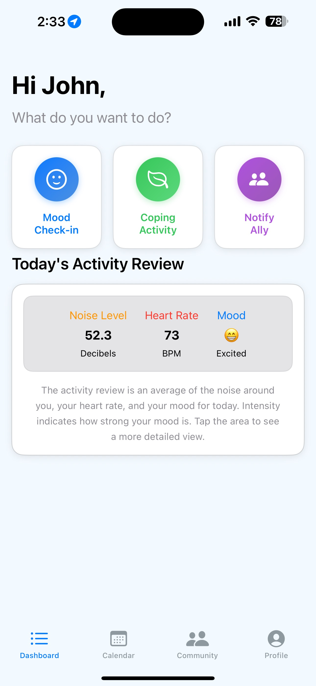</td>
    <td>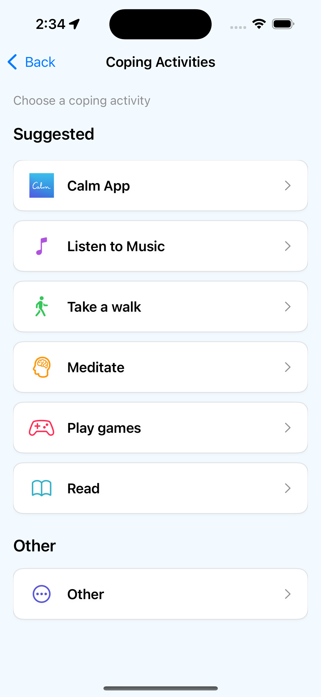</td>
    <td>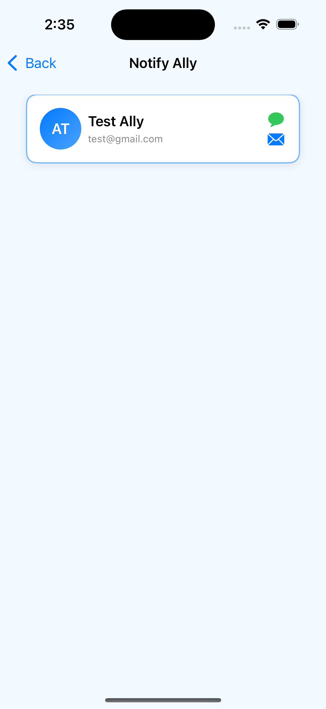</td>
  </tr>
  <tr>
    <td align="center"><b>Home Screen</b></td>
    <td align="center"><b>Coping Activities</b></td>
    <td align="center"><b>Ally Support</b></td>
  </tr>
  <tr>
    <td>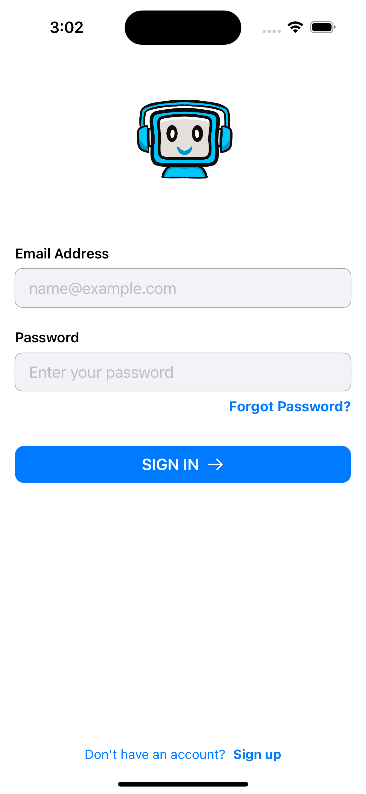</td>
    <td>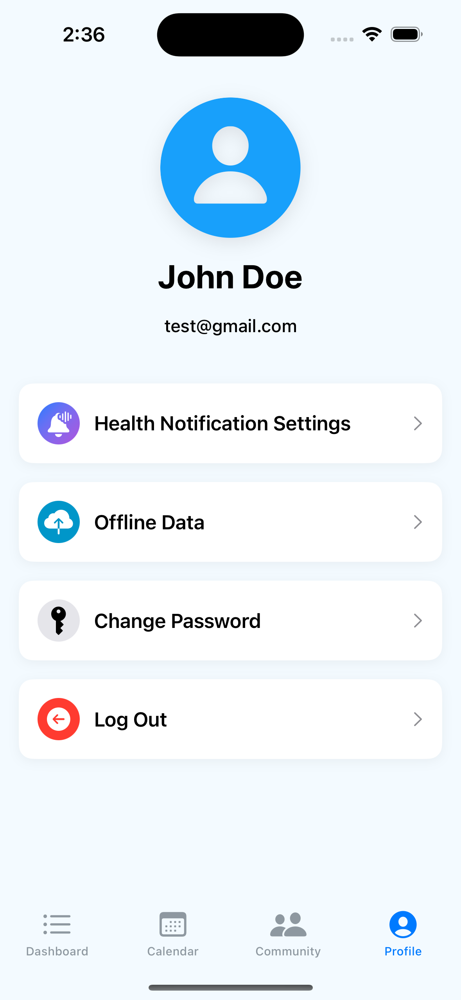</td>
    <td>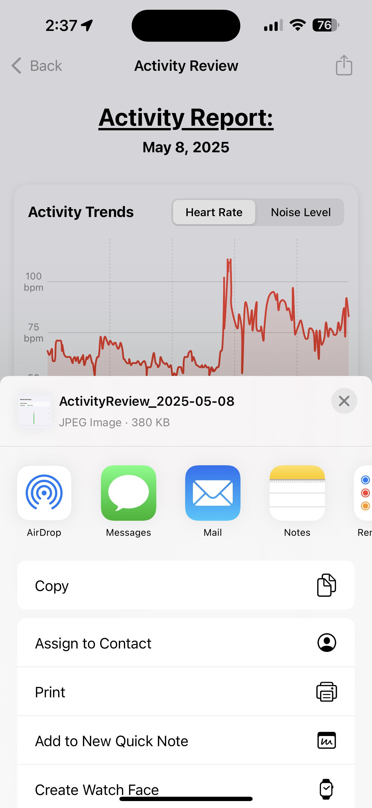</td>
  </tr>
  <tr>
    <td align="center"><b>Login</b></td>
    <td align="center"><b>Profile</b></td>
    <td align="center"><b>Reports</b></td>
  </tr>
</table>
</div>

### 🔄 Interactive Features

<div align="center">
<table>
  <tr>
    <td width="33%"><b>Mood Tracking</b><br>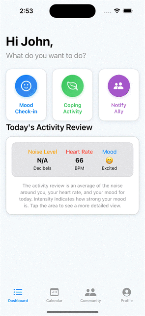</td>
    <td width="33%"><b>Account Registration</b><br></td>
    <td width="33%"><b>Adding an Ally</b><br>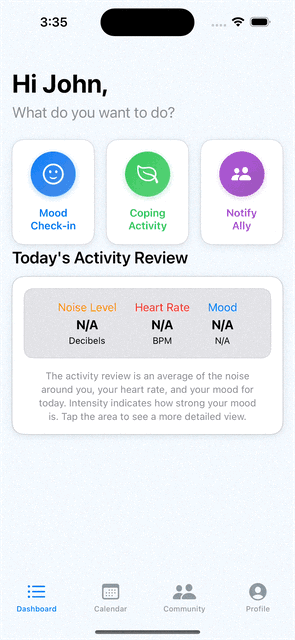</td>
  </tr>
  <tr>
    <td width="33%"><b>Email Notifications</b><br>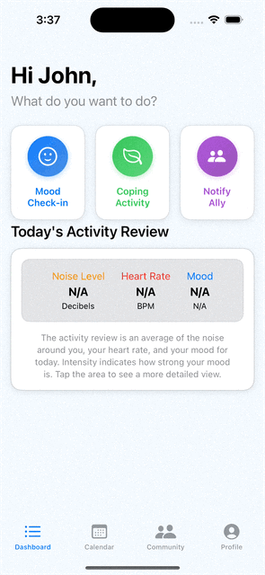</td>
    <td width="33%"></td>
    <td width="33%"></td>
  </tr>
</table>
</div>

### 🔔 Notifications

<div align="center">
<table>
  <tr>
    <td>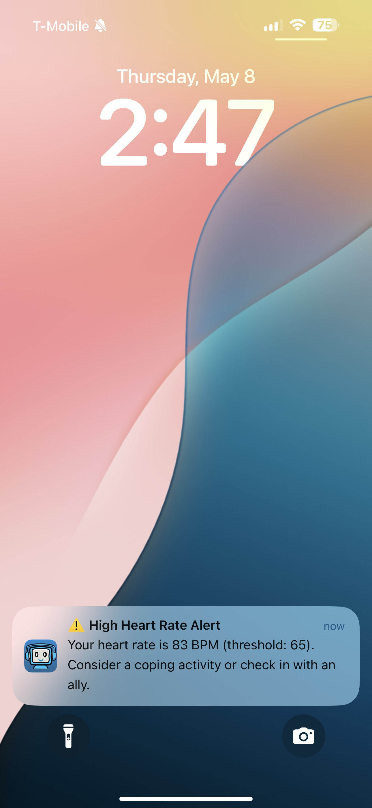</td>
    <td>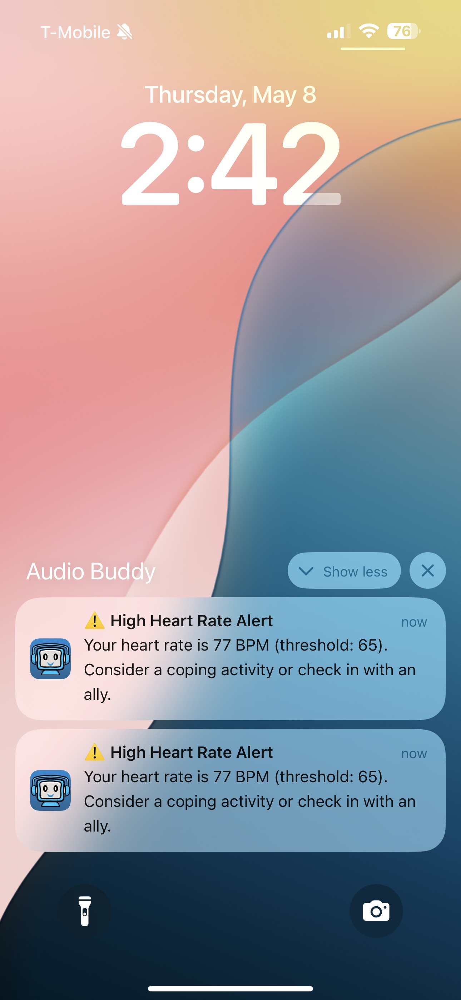</td>
    <td>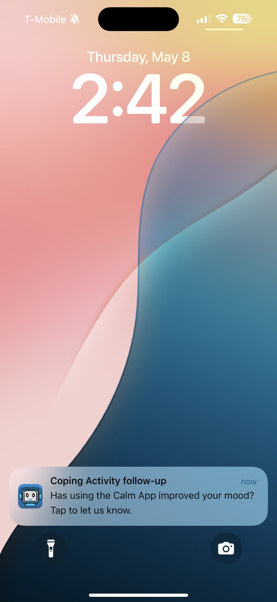</td>
  </tr>
  <tr>
    <td align="center"><b>Heart Rate Alert</b></td>
    <td align="center"><b>Noise Level Alert</b></td>
    <td align="center"><b>Coping Activity Reminder</b></td>
  </tr>
</table>
</div>

### 🤝 Community Features

<div align="center">
<table>
  <tr>
    <td>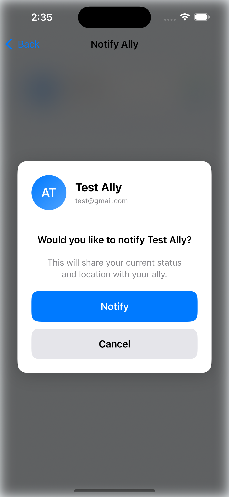</td>
    <td>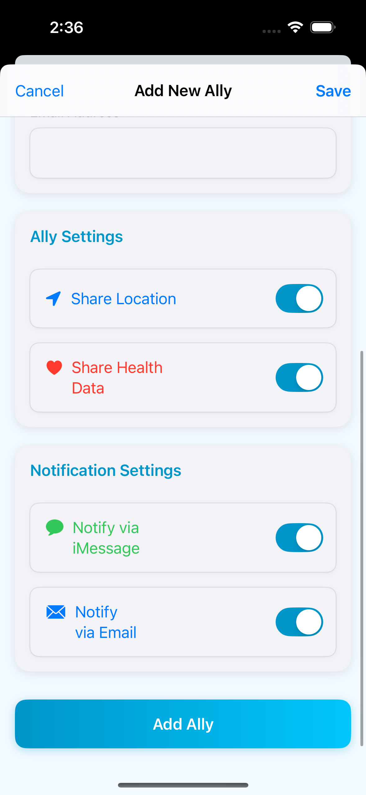</td>
    <td>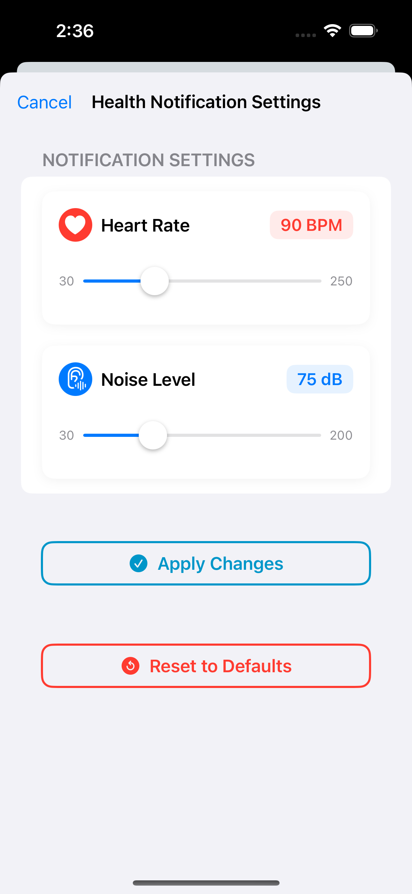</td>
  </tr>
  <tr>
    <td align="center"><b>Notify Ally</b></td>
    <td align="center"><b>Ally Notification Settings</b></td>
    <td align="center"><b>Health Notification Settings</b></td>
  </tr>
</table>
</div>

<!-- Section for end/non-technical users to see how the app works via screenshots etc.-->


## 📋 Requirements

- iOS 17.0 or later
- Xcode 15.0 or later
- iPhone (iPad not optimized)
- Access to HealthKit compatible device (for heart rate monitoring)

<!-- Developer information sectio -->

## 🚀 Getting Started

### Prerequisites

- Xcode 15+ installed
- Swift Package Manager
- Firebase account (for backend services)

### Installation

1. Clone the repository
   ```
   git clone https://github.com/yourusername/AudioBuddy.git
   cd AudioBuddy
   ```

2. Open `HRTest_AR.xcodeproj` in Xcode

3. Configure Firebase
   - Ensure `GoogleService-Info.plist` is in the project, this is pre-configured with the Firebase Project API Keys and Google Requirements
   - Ensure Firebase is properly initialized in AppDelegate

4. Set up HealthKit capabilities in Xcode project settings

5. Build and run the application

## 🔥 Firebase Project Information
**Note:** This information is for project developers only.

- **Project Name:** AudioBuddy
- **Project ID:** audiobuddy-7011f
- **Project Number:** 600195296339

For access to the Firebase project, contact:
- Luc Rieffel: lucrieffel8@gmail.com
- Emani Dotch: Emani.Dotch@gmail.com


User data is stored securely and used solely to provide the app's features and functionality.

## 👥 Contributing Developers
- Luc Rieffel
- Dr. Jesus Armando Beltran
- Dr. Arturo Morales

## 📄 License

This project is proprietary software. All rights reserved.

## 🔜 Future Development (Version 2)

Based on user feedback and planned enhancements, future versions will include(updated 5/15/2025):

### 🧘 Enhanced Coping Activities
- **Personalized Activity Library**: Save user-entered activities to prevent repeated "Other" entry
- **Activity Preferences**: Allow users to pre-select favorite activities during onboarding
- **Custom Categories**: Enable users to create custom categories for their coping strategies

<!-- ### 📱 Improved User Experience
- **Customizable Interface**: More options for personalizing the app interface
- **Extended Device Support**: Optimization for iPad and additional wearable devices
- **Accessibility Enhancements**: Improved features for users with disabilities -->

### 📊 Advanced Analytics
- **Firebase Analytics Integration**: Track app usage patterns and feature engagement
- **Notification Metrics**: Monitor notification delivery, interaction rates, and subsequent actions
- **User Journey Analysis**: Identify common paths through the application for UX optimization

<!-- ### 🔒 Enhanced Privacy Controls
- **Granular Data Sharing**: More detailed control over what data is shared with allies
- **Temporary Access Options**: Set time limits for location sharing during crisis situations -->

## 📞 Support

For support or questions, please contact [audiobuddy.notification@gmail.com](mailtoaudiobuddy.notification@gmail.com)
